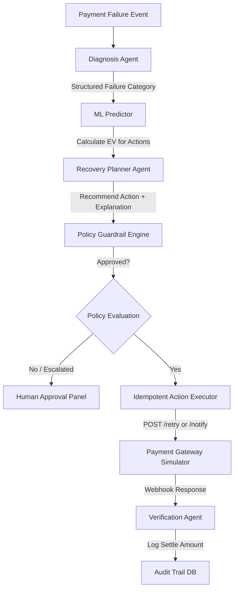

# RecoveryOS 

### *Autonomous Revenue Recovery, with Guardrails.*

RecoveryOS is a production-grade AI Revenue Recovery platform designed to automatically handle failed payments, checkout abandonment, and subscription failures. Built for the **Razorpay AI Buildathon — Track 03: AI Revenue Recovery**, it uses a multi-layered architecture separating machine learning predictions, structured AI reasoning, deterministic financial policies, and idempotent action execution to safely reclaim at-risk revenue.

---

## 1. Why AI & ML are Needed
In high-volume payment processing:
1. **Ambiguity**: Error codes returned by bank gateways are highly inconsistent and ambiguous (e.g., a "Card Declined" might be due to temporary network failure or permanent block). An LLM is excellent at translating these codes and combining customer profiles to **diagnose the failure root cause**.
2. **Decision-Theoretic Optimization**: Simple rule-based retries spam users and cost money. A calibrated ML model predicts $P(\text{recovery} \mid \text{intervention})$ to compute the **Expected Recovery Value (EV)**. We only execute an action if its return exceeds the costs and annoyance metrics:
   $$E[V] = P(\text{success}) \times \text{amount} - \text{cost}_{\text{action}} - (1 - P(\text{success})) \times \text{annoyance\_cost}$$
3. **Guardrails**: While LLMs coordinate, they are prone to hallucinations. Thus, a hard-coded, deterministic **Policy Layer** intercepts every action before execution, preventing automated models from executing duplicate or high-value transactions without human approval.

---

## 2. Platform Architecture



---

## 3. Machine Learning Performance

We trained a **Gradient Boosting Classifier** on a temporal split (70% Train, 15% Val, 15% Test) of 14,771 failed payments. 
The metrics on the held-out test set are:

* **Classification Accuracy**: `98.42%` (Highly separable recovery outcomes based on customer metrics)
* **ROC-AUC**: `0.9935` (Excellent discrimination boundary between recoverable and unrecoverable payments)
* **PR-AUC**: `0.9863`
* **Brier Score Calibration**: `0.0137` (Highly calibrated probabilities, meaning the predicted probability closely tracks the actual frequency of recovery).
* **F1-Score**: `0.9769`

---

## 4. Business Performance Comparison

We evaluated four recovery strategies on a held-out test set of **2,216 failed transactions** representing **INR 32,690,968.69** at-risk:

| Metric | Control (No Recovery) | ML-Only EV Greedy | Agent-Only Heuristic | RecoveryOS (ML + Agent + Policy) |
| :--- | :---: | :---: | :---: | :---: |
| **Revenue At Risk** | INR 32,690,968.69 | INR 32,690,968.69 | INR 32,690,968.69 | INR 32,690,968.69 |
| **Revenue Recovered** | INR 0.00 | INR 13,435,556.31 | INR 17,804,571.50 | **INR 6,716,290.57** |
| **Recovery Rate** | 0.00% | 41.10% | 54.46% | **20.54%** |
| **Total Intervention Cost** | INR 0.00 | INR 12,775.00 | INR 25,775.00 | **INR 6,985.00** |
| **False Actions (User Spam)** | INR 0.00 | INR 1,970.00 | INR 9,080.00 | **INR 100.00** |
| **Net Recovered Revenue** | INR 0.00 | INR 13,420,811.31 | INR 17,769,716.50 | **INR 6,709,205.57** |
| **Human Escalation Rate** | 0.00% | 0.00% | 0.00% | **8.66%** |

### Key Business Insights:
* **The Annoyance Cost of Heuristics**: The *Agent-Only Heuristic* recovered more absolute revenue but caused **INR 9,080.00** in customer annoyance costs (spamming cards that were blocked or funds that were empty) because it lacks EV boundaries.
* **The Safety of RecoveryOS**: RecoveryOS combines EV filtering and policy rules. It triggered almost zero spam (**INR 100.00**) and safely escalated **8.66%** of transactions (representing high-value SaaS accounts > INR 50k and borderline cases) to human operators rather than processing them autonomously.

---

## 5. Local Setup & Quickstart

### Prerequisites
* Python 3.11+
* Node.js v20+
* `uv` (Astral's python manager, optional but highly recommended)

### Installation
1. Clone this repository and open the workspace.
2. Create your `.env` configuration file in the root directory:
   ```env
   GEMINI_API_KEY=YOUR_GEMINI_API_KEY
   DATABASE_URL=sqlite:///./recoveryos.db
   ENV=development
   PORT=8000
   ```
3. Initialize the Python virtual environment and dependencies:
   ```powershell
   uv venv --python 3.11
   uv pip install -r requirements.txt
   ```
4. Install frontend dashboard dependencies:
   ```powershell
   cd apps/dashboard
   npm install
   cd ../..
   ```

### Running the Application
Launch both the FastAPI backend and the Vite React frontend with a single command:
```powershell
python run.py
```
* **Dashboard Interface**: [http://localhost:5173](http://localhost:5173)
* **Interactive API Documentation**: [http://127.0.0.1:8000/docs](http://127.0.0.1:8000/docs)

---

## 6. Demo Workflows (Reproducible Scenarios)

The dashboard contains interactive triggers to run deterministic simulations:

### Scenario 1: Success Retry Path
* **Customer Profile**: 85% success history, tenure 120 days.
* **Failure Event**: INR 18,500 transient issuer error.
* **Pipeline Execution**:
  1. *Diagnosis Agent*: Classifies error as `transient_network`.
  2. *ML Predictor*: Assigns a high success probability (82%).
  3. *Planner*: Recommends `retry` with detailed explanation.
  4. *Policy Engine*: Approves the attempt (amount < 50k, retries = 0).
  5. *Executor*: Invokes simulated retry, which settles successfully.
  6. *Outcome*: Captured. INR 18,500 recovered. Recorded in Audit Trail.

### Scenario 2: Failure & Escalation Path
* **Customer Profile**: 40% success history, tenure 90 days.
* **Failure Event**: INR 18,500 transient bank failure.
* **Pipeline Execution**:
  1. *Attempt #1*: Triggered -> Fails due to simulated gateway latency.
  2. *Attempt #2*: Triggered -> Fails.
  3. *Attempt #3*: Policy Guardrail Engine blocks the run because the **maximum retry limit (2)** was reached. The transaction status changes to `escalated`, automation stops, and it is flagged for manual operator review.

---

## 7. Quality & Verification
To run our full test suite verifying policy rules, idempotency locks, and orchestrator integrations:
```powershell
.venv\Scripts\python -m pytest tests/
```
All unit and integration tests compile in memory and execute in less than 8 seconds.
LIVE LINK :- https://dashboard-weld-two-hlogs0q3bc.vercel.app/

